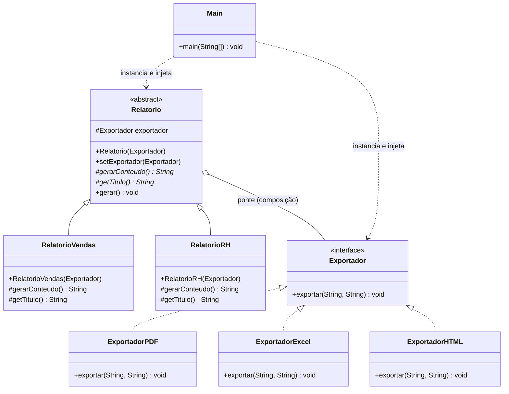
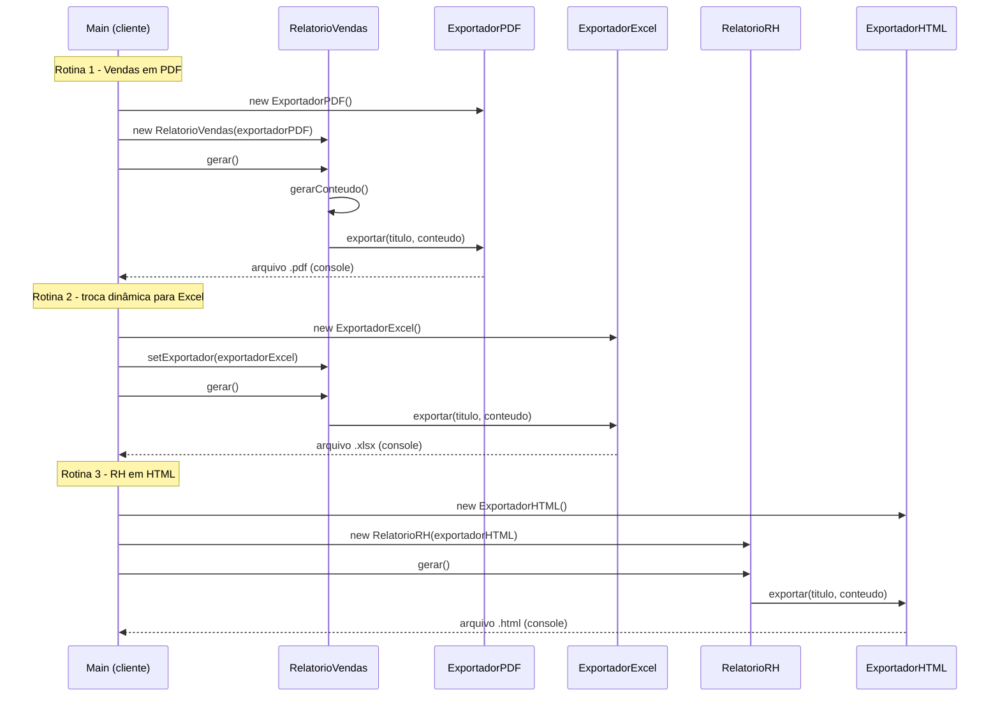

# Padrão Bridge — Módulo de Relatórios (TechFatec)

Projeto da disciplina de Padrões de Projeto — Fase 2 (Implementação e Controle de Versão).

**Dupla:** Mariana Akemi Arashiro Santos Feitosa e Giovana Marsigli Rodrigues

## 1. Contexto do problema

O sistema legado de BI da TechFatec gerava apenas **um** relatório (Vendas) em **um**
formato (PDF). O novo requisito trouxe um segundo relatório (Desempenho de RH) e a
exigência de que **todos** os relatórios, atuais e futuros, sejam exportáveis em
**PDF, Excel (XLSX) e HTML**.

Se a modelagem fosse feita por herança direta (`RelatorioVendasPDF`,
`RelatorioVendasExcel`, `RelatorioRHHTML`, ...), o número de classes cresceria de forma
multiplicativa (`nº relatórios × nº formatos`) a cada novo relatório ou formato —
a chamada **"explosão de subclasses"**. O padrão **Bridge** resolve isso separando
duas hierarquias que variam de forma independente:

- **Abstração** — *o que* é o relatório (Vendas, RH, ...);
- **Implementação** — *como* ele é exportado (PDF, Excel, HTML, ...).

As duas hierarquias se comunicam por composição (uma "ponte"), não por herança.

## 2. Estrutura de diretórios

```
src/
├── abstracao/          # Hierarquia da Abstração (o "o quê")
│   ├── Relatorio.java          -> Abstraction (abstrata)
│   ├── RelatorioVendas.java    -> RefinedAbstraction
│   └── RelatorioRH.java        -> RefinedAbstraction
├── implementacao/       # Hierarquia do Implementor (o "como")
│   ├── Exportador.java         -> Implementor (interface)
│   ├── ExportadorPDF.java      -> ConcreteImplementor
│   ├── ExportadorExcel.java    -> ConcreteImplementor
│   └── ExportadorHTML.java     -> ConcreteImplementor
└── cliente/
    └── Main.java        # Monta as dependências e valida o desacoplamento
```

## 3. Diagrama de classes



## 4. Diagrama de sequência (rotinas do cliente)



## 5. Injeção de dependência

Nenhuma classe em `abstracao/` usa `new ExportadorX()`. `Relatorio` recebe um
`Exportador` **pronto** pelo construtor:

```java
protected Relatorio(Exportador exportador) {
    this.exportador = exportador;
}
```

A troca em tempo de execução é feita por um setter, sem recriar o objeto `Relatorio`:

```java
public void setExportador(Exportador exportador) {
    this.exportador = exportador;
}
```

Quem decide **qual** `Exportador` concreto usar é sempre a classe `cliente.Main` —
a única camada que conhece as duas hierarquias ao mesmo tempo.

## 6. Aderência ao Open/Closed Principle

- Para adicionar um **novo formato** (ex.: CSV), basta criar `ExportadorCSV implements Exportador`.
  Nenhuma classe de relatório é tocada.
- Para adicionar um **novo relatório** (ex.: Relatório Financeiro), basta criar
  `RelatorioFinanceiro extends Relatorio`. Nenhuma classe de exportação é tocada.
- O sistema está **aberto para extensão** (novas subclasses) e **fechado para
  modificação** (classes existentes permanecem intactas).

## 7. Como compilar e executar

```bash
javac -d bin $(find src -name "*.java")
java -cp bin cliente.Main
```

A saída no console demonstra, em sequência, as três rotinas exigidas: geração do
Relatório de Vendas em PDF, troca dinâmica do mesmo relatório para Excel, e geração
do Relatório de RH em HTML — sem que nenhuma classe de relatório precise conhecer os
detalhes de formatação de cada exportador.
